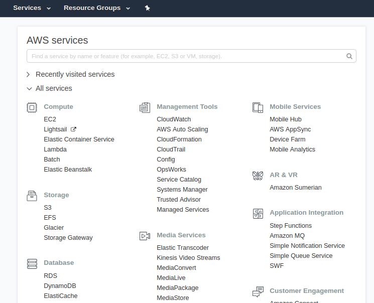
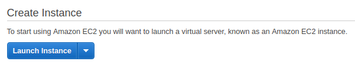
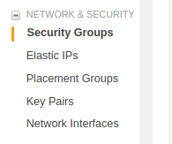
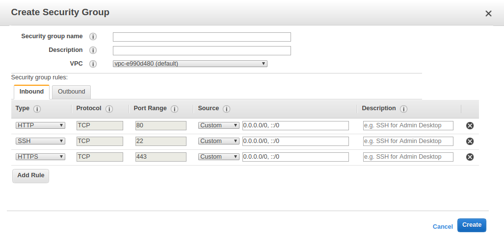
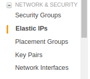
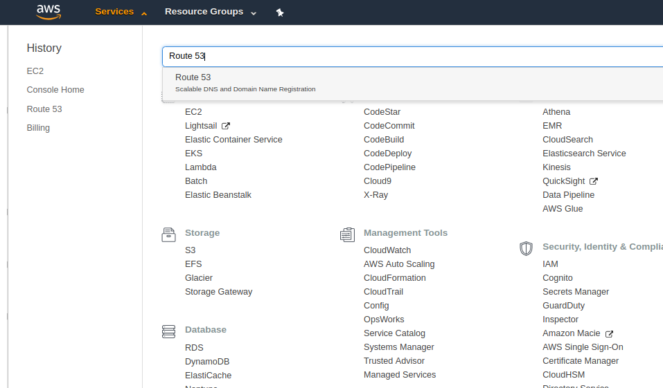
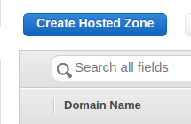
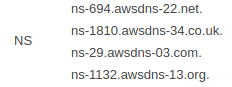
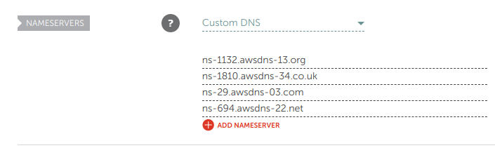

## Create an AWS EC2 instance

Log into AWS and create an account if you don’t have one already. Log in and you should see your dashboard, or a list of services



Select EC2. Then select Launch Instance.



If you are just prototyping a simple website then choosing the latest Ubuntu Server image is fine. Make sure to save your private key somewhere safe.

## Connecting to your EC2 instance

Test your new EC2 instance by connecting to it.

```sh
ssh -i keyname.pem user@your-ec2-address
```

Or press the Connect button while on your EC2 console for exact instructions.

Your ec2 address looks something like ec2-55-55-555-55.xx-yyyy-5.compute.amazonaws.com

Success? Great good to go!

## Setup your Security Groups

Let’s open up some ports so requests can make it to our instance. At the AWS Dashboard, find the link to “Security Groups” on the left.



Then click “Create”


Make the following rules



Click the “Create” button in the bottom right. Next, go back to “Instances” and under “Actions” select “Networking”->”Change Security Groups” and select your newly created security group. Mine was called something like launch-wizard-1. Remember to click “Assign Security Groups” after you check the box.

## Create your Elastic IP

This allows for better DNS.



Click the blue “Allocate new address” button, then select “Allocate”. Next, select the created Elastic IP and select “Actions”->”Associate”. Then select your EC2 Instance. It’s that easy.

## Create and configure a Hosted Zone

We will use the Route 53 service for this. Select it from the Services menu.



Select “Create Hosted Zone”



Hit “Create”. Back at the Route 53 Dashboard, select the created Hosted Zone and click “Go to Record Sets”.Click “Create Record Set”, leave the Name field blank, and place your Elastic IP into the Value field. Then, hit Create.

Hit “Create Record Set” again. Put “www” in the Name field, and place your Elastic IP into the Value field. Then, hit Create.

Next, click the Go to Record Sets button. Take the dns servers in the Values column of your NS record…



And set your Namecheap DNS servers to them (without the period at the end). Yours may be different than mine. These may take up to a few hours to propogate.



## Set up Nginx

Right. Now lets ssh into our EC2 instance and setup the Nginx webserver.

```sh
sudo apt-get install nginx
```

Navigating to your Elastic IP, you will see the default Nginx page.

Next, let’s setup Let’s Encrypt using Certbot.

```sh
cd /etc/nginx/sites-available
sudo nano default
```

Edit the lines near the top specifying the server name

```sh
server {
listen 80 default_server;
listen [::]:80 default_server;
```

Replace both the two “listen” lines with the following. Ues your domain instead of “example.com”

```
listen 80 example.com www.example.com
```

Let’s install certbot and build our certificate.

```
sudo apt-get install software-properties-common
sudo add-apt-repository ppa:certbot/certbot
sudo apt-get update
sudo apt-get install python-certbot-nginx
```

And make it!

```sh
sudo certbot --nginx -d example.com -d www.example.com
```

It may prompt you for some things. Follow the instructions. Now lets configure Nginx to be a reverse proxy to our application.

```sh
cd /etc/nginx/sites-available
cp default default.bak
sudo nano default
```

Here is a popular reverse proxy https config that you can replace the server block with. Remember to replace example.com with your domain.

```sh
server {
listen 80;
listen [::]:80;
server_name example.com www.example.com;
return 301 https://$server_name$request_uri;
}
server {
listen 443 ssl http2 default_server;
listen [::]:443 ssl http2 default_server;
server_name example.com www.example.com;
location / {
proxy_pass http://localhost:3000;
}
ssl_certificate /etc/letsencrypt/live/example.com/fullchain.pem;
ssl_certificate_key /etc/letsencrypt/live/example.com/privkey.pem;
ssl_protocols TLSv1 TLSv1.1 TLSv1.2;
ssl_prefer_server_ciphers on;
ssl_ciphers EECDH+CHACHA20:EECDH+AES128:RSA+AES128:EECDH+AES256:RSA+AES256:EECDH+3DES:RSA+3DES:!MD5;
ssl_session_cache shared:SSL:5m;
ssl_session_timeout 1h;
add_header Strict-Transport-Security “max-age=15768000” always;
}
```

And now just restart Nginx

```sh
sudo service nginx restart
```

## Run your App!

The reverse proxy is set to forward everything to port 3000 which is the default Express port!

```sh
cd ~/yourapp
npm start
```

Visit your domain name to see all the https goodness!
