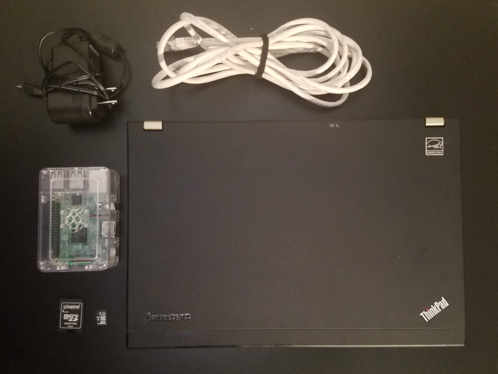
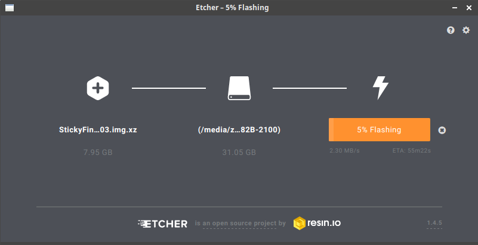
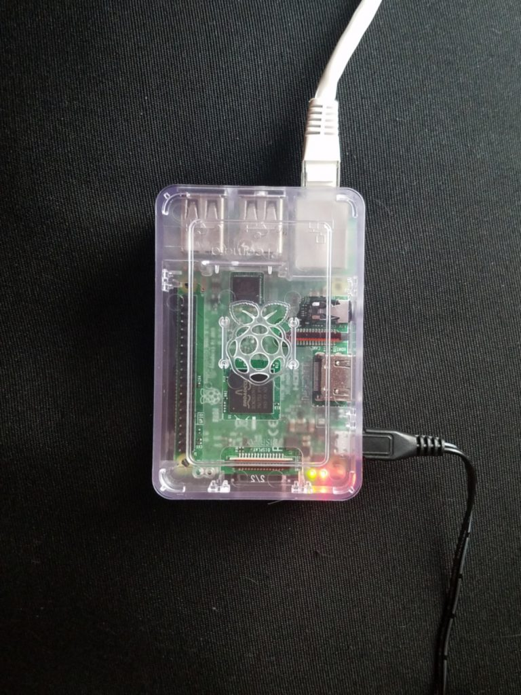
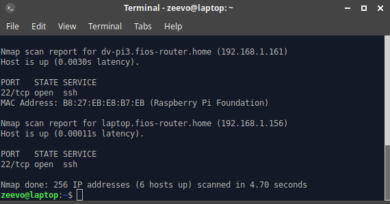

I wanted to do something like for a while now – I am going to show you how to create your own pen testing lab where you can practice your skills in a controlled environment.

## The Equipment

Here is everything you need to make a killer lab.

Raspberry Pi (B, B+) – amazon
Micro USB Power Supply (2.5A+ preferably) – amazon
Ethernet cable
MicroSD Card (8+ GB preferably) + Adapter – amazon
SD Card writer – amazon
Case (optional) – amazon



## The Setup

Download Re4son’s Damn Vulnerably Pi Image. Insert your microSD Card into your SD Card adapter, and then insert it into your SD Card reader.

Flash it using Etcher



Or flash it using the following shell commands

```sh
sudo fdisk -l
```

…to locate it. Then dump the contents of the image to it.

```sh
sudo umount /dev/sdx\*
sudo dd bs=1M if=StickyFingers-DV-Pi3-180703.img.xz.img of=/dev/sdx
```

Plug your AC Adapter into your Pi, connect it to your local network using your Ethernet cable + Router.



Find your device
To SSH into your Raspberry Pi, you can do a quick nmap to find it on your network

```sh
nmap -p 22 192.168.1.0/24
```

Then SSH in when you find its IP.



```sh
ssh pi@your_address
```

Password: raspberry

DV-PI has a Vulnerable state and Invulnerable state. You can switch between the two using the built-in dv-pi tool.

```sh
dv-pi status # Show status of vulnerable applications
dv-pi start # Start vulnerable applications
dv-pi stop # Stop vulnerable applications
```

Next time I will show you a beginner’s attack for your new target. Happy hacking!
