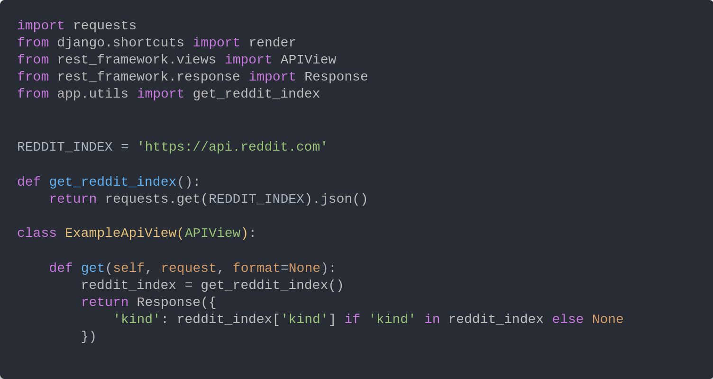
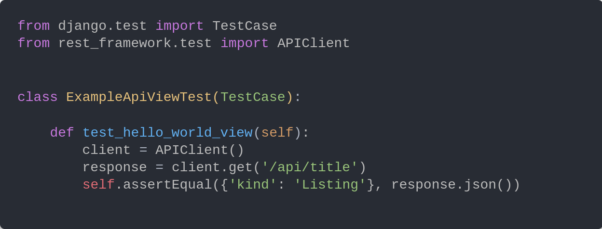
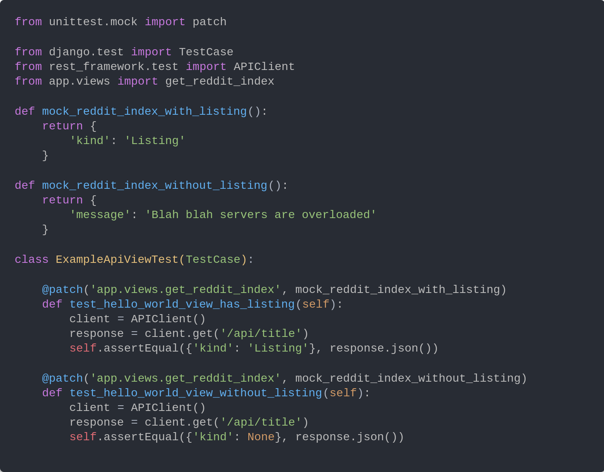
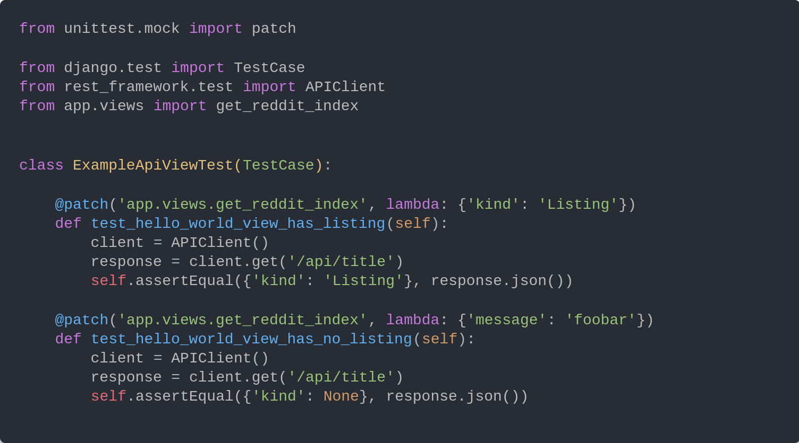

Today I would like to offer a brief showcase on how to effectively test a Django API. Essentially, what we want to accomplish is the ability to test and control how our applications handle specific responses from external web APIs. A program might make calls to several different APIs like Reddit’s or Google’s, and we want to capture these responses under test. More importantly, in a way that our tests can pass every time regardless of the status of the APIs we consume.

## How?

By using Patch.

Patch is a decorator in the library `unittest.mock`. It allows us to replace attributes in our program with mock objects and make assertions on how our program with behave. Let’s take a look.

Here we have a simple Django API generated using my project starter. It makes a query to Reddit’s API for information, and returns a simple JSON payload to the client.

And of course, a corresponding test:

But wait- what if Reddit’s API is down? Our test will fail. Unit tests should never fail because of someone else’s application. They should always pass regardless of the status of other systems. We also cannot reliably capture both (1) Reddit is ok, and (2) Reddit is down. For this, we need to use Patch to usurp our call to to Reddit’s API with a mock function.

Let’s rewrite our test using Patch:

We now will never fail due to an external system not behaving because regardless of the real status, our view will always receive exactly what we want to test.

We can improve the readability and organization of our mocks using the lambda keyword. Its not often I find an appropriate use of lambda so it’s worth highlighting. Here are the final tests rewritten:

## Let’s Summarize

We want to capture our API responses under test. So we used unittest. However, sometimes our API is dependent on other systems, causing a dependence and a potential to fail intermittently. To solve this issue, we use patch. Patch allows us to usurp the underlying functions, and implement our own test functions. Then, we used the lambda keyword to define our mocks inline for better readability.

Thanks for reading and Happy Hacking!
