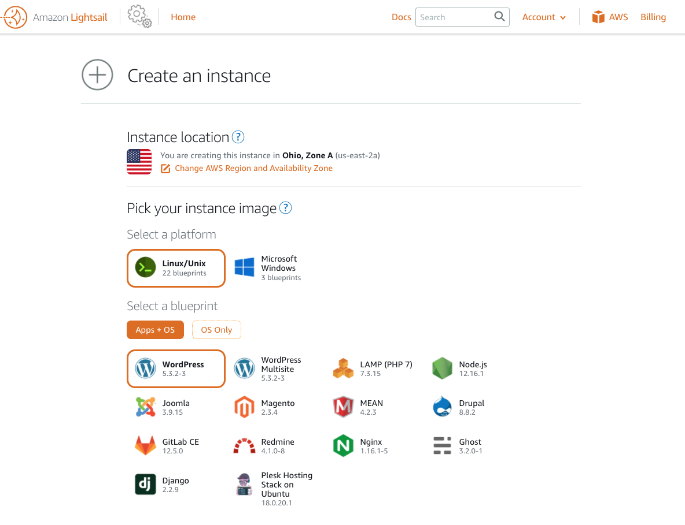
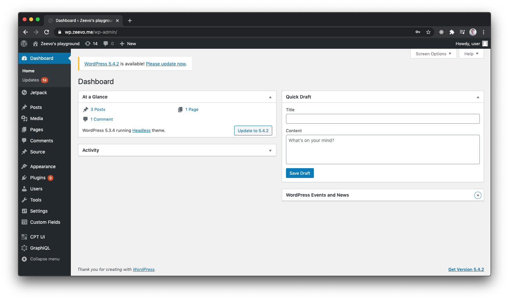
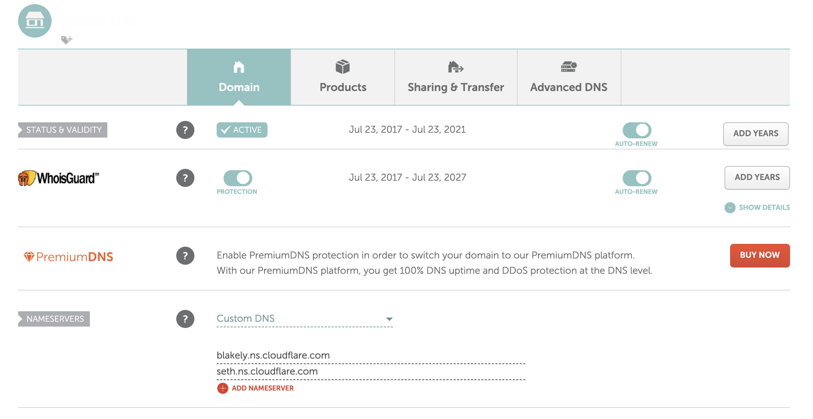
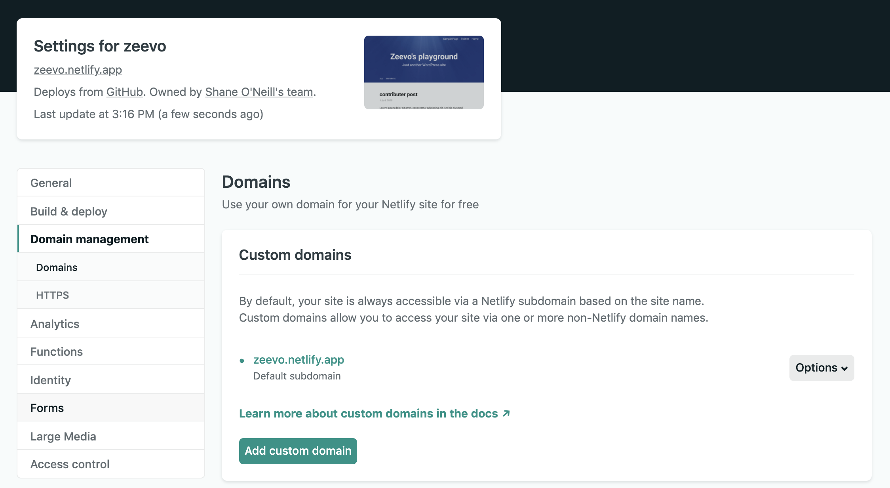
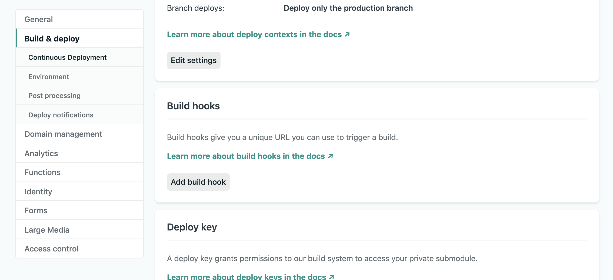
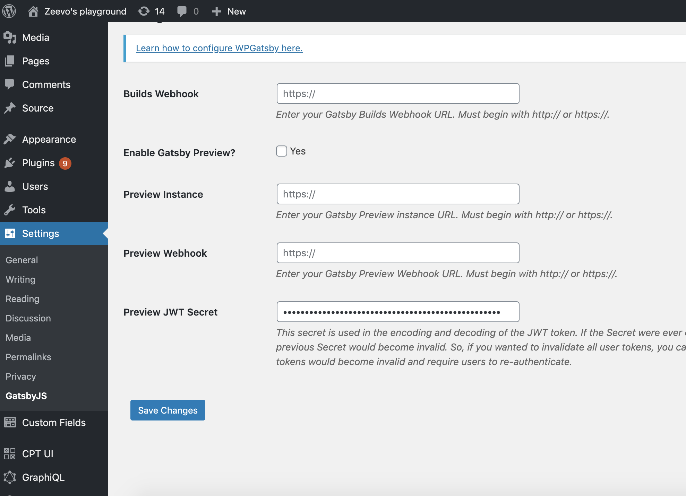
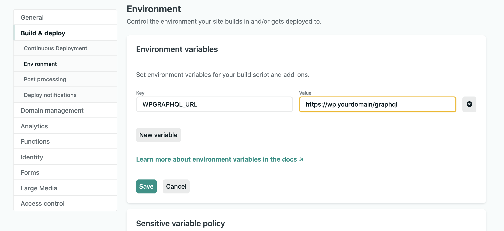
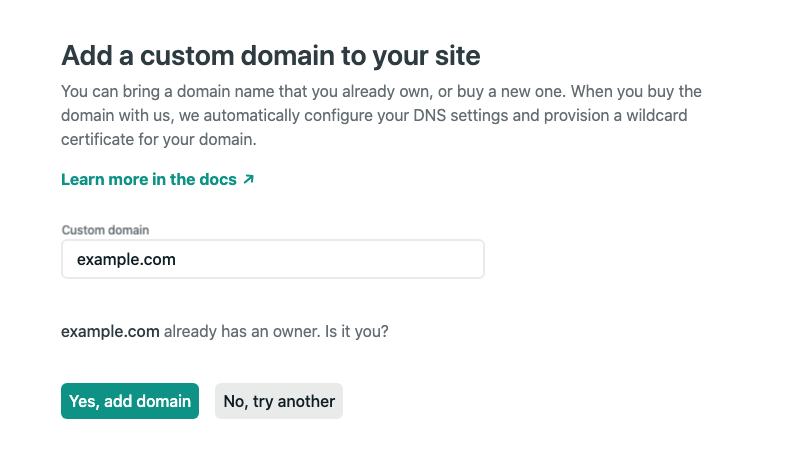
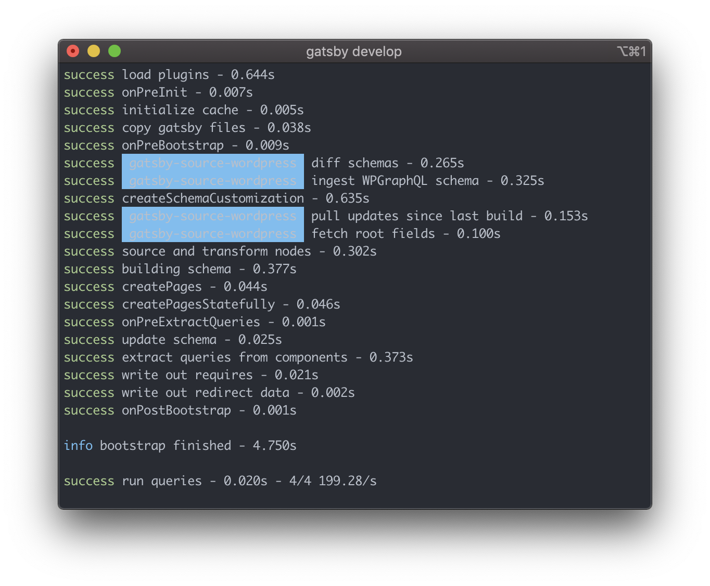
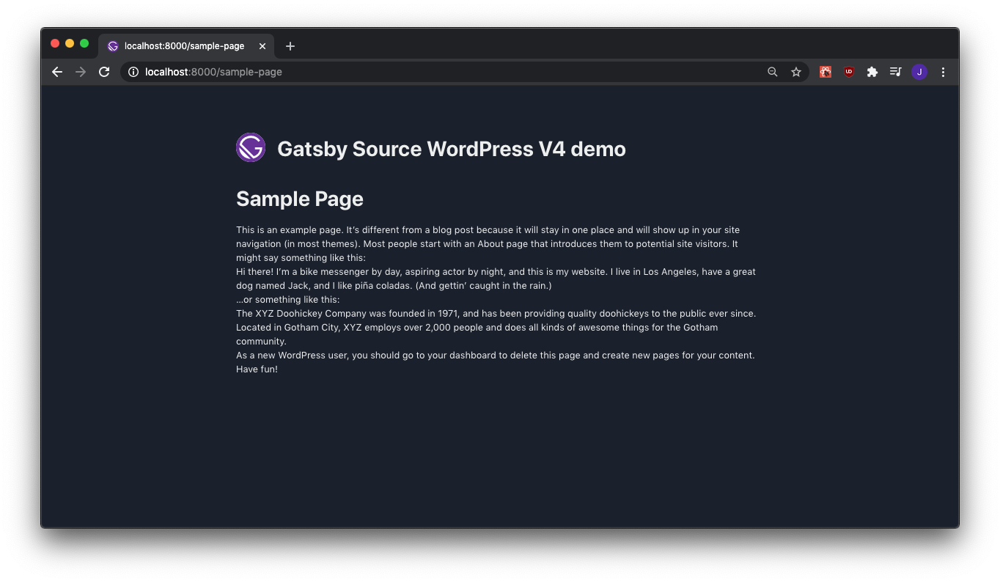

We have come a long way in terms of how we build websites in the modern age.
From coding raw HTML files, to PHP servers, to full JavaScript Web Applications,
the web has just gotten better and better. The [JAMstack](https://jamstack.org/)
is here and it is awesome. JAMstack is a combination of **J**avaScript,
**A**PIs, and **M**arkdown to build static sites from dynamic content. It has a
fantastic Developer Experience, increased security, cheap hosting, and extreme
performance. This guide will show you how to setup a production-ready setup, but
feel free to skip to the sections that are relevant to your specific needs.

Today we will be building one of these application using
[Gatsby](https://gatsby.org) and [Wordpress](https://wordpress.org/) +
[WPGraphQL](https://www.wpgraphql.com/).

## Table of Contents

```toc
# This code block gets replaced with the TOC
```

## Stack

The following stack may seem intimidating, but each piece is very easy to use
with amazing GUIs. This setup is extremely cheap--Only the Wordpress component
is not free--And it has the flexibility to be a reliable production deployment.

- **Gatsby App
  [gatsby-starter-zeevo-wordpress](https://github.com/zeevosec/gatsby-starter-zeevo-wordpress)**
  - A super simple Gatsby app powered by Wordpress. Open source!
- **AWS Lightsail for Wordpress**
  - An easy to use Wordpress as a service. Use whatever your favorite Wordpress
    hosting service is!
- **Netlify for hosting and DNS**
  - Netlify is the leader in JAMStack hosting. Free!
  - They also offer killer DNS management

## Setup Wordpress on AWS Lightsail

AWS Lightsail is a great service that allows you to spin up Wordpress
installations in seconds, and removes all of the hassel of server
administration. You simply checkout your Wordpress image and size, and receive
an IP of the running server.

If you have not already, create an [AWS account](https://aws.amazon.com/premiumsupport/knowledge-center/create-and-activate-aws-account/).
Navigate to [AWS Lightsail](https://aws.amazon.com/lightsail/)



After checkout, you will be able to get your default SSH keys from your
navigating to your account page in the top right of the Lightsail dashboard. You
will need your keys to SSH into your server and install plugins. It may or may
not be called `us-east-2.pem`. Make sure you save these somewhere secure.

You can SSH into your Wordpress instance with the following command. Run it
inside your favorite terminal emulator:

```
chmod 400 your-key.pem
ssh -i your-key.pem bitnami@<your-lightsail-ip-address>
```

Once you are in, grab your username and password from the credentials file in
your home folder.

```
cat bitnami_credentials
```

Login to your Wordpress admin dashboard that is located at
`<your-lightsail-ip-address>/wp-admin`

You should now have a terminal logged in to your server and the admin dashboard
ready to go in your browser.



### Install plugins

We will need to install a few essential plugins, but I will also be installing
some **luxury** plugins.

#### Essentials

- WPGraphQL
- WPGraphiQL
- WPGatsby

Install:

```
# Inside your Wordpress server
cd ~/apps/wordpress/htdocs/wp-content/plugins
git clone https://github.com/wp-graphql/wp-graphql
git clone https://github.com/wp-graphql/wp-graphiql
git clone https://github.com/gatsbyjs/wp-gatsby
```

#### If you need them

Next, you can totally consider also installing the following plugins for more
features

- Advanced Custom Fields
- ACF For WPGraphQL
- Custom Post Types
- Custom Post Types GraphQL

Installing all of the above will give you a beefy, production-ready setup.

### Themes

You can use any theme you want on Wordpress -- But remember, this is not going
to be reflected to your users. Your users are going to see your Gatsby site, not
your Wordpress site. Because of this, I recommend using a headless theme, or
even not giving any thought to your Wordpress theme at all.

You can install my headless theme with the following:

```
cd ~/apps/wordpress/htdocs/wp-content/themes
git clone https://github.com/zeevosec/wordpress-headless

# IMPORTANT: Change the href in this theme to reflect where your Gatsby app lives.

vim wordpress-headless/index.php
```

## DNS

DNS is the protocol in which browsers and other application can find the actual
IP Address of the server which we want to visit. Think of it as though you are
translating people (domains) to phone numbers (ip addresses) in a big phonebook.

I recommend using the following stack of services for DNS/Domain Name-related
things:

- **Namecheap** to buy your domain name
- **Netlify** for site hosting and DNS

Essentially, what we want to achieve is to use `www.yourdomain.com` as our
**primary** domain and `yourdomain.com` seconday. You can think of
`www.yourdomain` as where your website lives, and `yourdomain.com` as the base
domain from which you can setup other types of DNS records against (mail, etc).
The reason for this can be somewhat technical, but Jen Kagan from Netlify does a
great job summarizing this concisely:

> You might think that you could simply configure a CNAME record for the apex
> domain—point example.com to <automatically-generated-name>.netlify.app—but you
> shouldn’t! This could severely break other things for you. According to the
> DNS specification, any domain name that has a CNAME record set cannot have any
> other DNS records associated with it. This means that if you set up a CNAME
> record for example.com, you wouldn’t be able to set up MX records—so you
> wouldn’t be able to receive email at that domain. Want to validate your domain
> for Google’s webmaster tools? Or perhaps you’d like to use the SPF system to
> help verify your email sending hosts? You’d need to add a TXT record to the
> apex domain, but you wouldn’t be allowed to because you already have a CNAME.
>
> -- <cite>Jen Kagan</cite>

Steps you will need to do:

1. Purchase your Domain from [Namecheap](https://www.namecheap.com/)

2. Sign up with [Netlify](https://link)

With your accounts setup, you are ready to move on.

### Namecheap

Cloudflare is the leading DNS platform and I recommend using it over your domain
registrar's DNS. It is completely free for personal sites. To do this we will
need to configure Namecheap to use Cloudflare's Name Servers. At the time of
writing this, they are publicly listed as the following:

- blakely.ns.cloudflare.com
- seth.ns.cloudflare.com

If you are using Namecheap, log into your dashboard, select "Manage" on your
domain. In the DNS tab, you should be able to select Custom DNS and supply
Netlify with Cloudflare's nameservers.



Save and you are done.

### Netlify

Netlify is a fantastic company that is changing the web as we know it. I highly
recommend using them to host your Gatsby site. First, we need a site to begin with:

```
gatsby new gatsby-starter-default https://github.com/gatsbyjs/gatsby-starter-default
```

Create a Github repository for your new app and push your starter to it.

```
cd gatsby-starter-default
git remote add origin https://github.com/yourusername/yoursite.git
git add .
git push -u origin master
```

Log in to [Netlify](https://www.netlify.com/), and select "New site from Git", then select Github, and then your site. After it builds you should get a Netlify URL.

Netlify offers some DNS solutions, but I suggest keep it simple with just your Netlify URL. Mine looks like this:



#### Netlify Build Hook

Netlify offers the ability to trigger builds through what is called a Build Hook. We can supply Wordpress with our Build Hook, so that it can trigger new builds when content changes.



Create yours and then copy it over to Wordpress. In your Wordpress dashboard,
under Settings, there should be a GatsbyJS option that brings you to a place
where you can save your Netlify Build Hook.



#### Netlify Environment



Update your Netlify environment with the location of your Wordpress app. Lots of starters use the key `WPGRAPHQL_URL` to track their source endpoint.

#### Netlify DNS

Log in to [Netlify](https://www.netlify.com/).

Navigate to your site from your **Sites** page, and then into **Settings**, and
then into **Domain Management**. Click the `Add custom domain` button, and enter
your domain name. If my domain was `example.com` I would input `example.com`,
select verify, confirm that I own this domain by selecting `Yes, add domain`.



Now, you should have 3 entries under your Domain Management.

  - The Netlify default subdomain
  - Your primary domain
  - and a "www" entry that redirects automatically to your primary domain

I would consider making the "www" domain our primary domain based off of a
[great blog post by the Netlify team](https://www.netlify.com/blog/2017/02/28/to-www-or-not-www/)

Netlify will begin provisioned

## Putting it all together

You can almost think of the relationship between these two technologies as our
"frontend" being Gatsby and our "backend" being Wordpress. But our frontend will
be completely static. How is this possible? Well, Gatsby will query our
Wordpress app for content using GraphQL, and generate a blazing-fast static site
that we can host cheaply. When content changes in Wordpress (new Post, new
Comment), we will simply rebuild our site-- Giving the illusion that we're truly
dynamic, but reaping all the rewards of static hosting.

Let's use a Gatsby starter.

```
gatsby new my-site https://github.com/TylerBarnes/using-gatsby-source-wordpress-experimental
cd my-site
```

This project uses `env` files to configure the Wordpress GraphQL endpoint. Let's create one for development.

```
echo "WPGRAPHQL_URL=https://wp.yourdomain.com/graphql" > .env.development
```

Now we can build it and see the content from our Wordpress app being rendered using
Gatsby and React. GraphQL API requests are being sent at _build time_, and a static site (HTML, CSS, JS) will be generated.

```
gatsby develop
```



The stock bitnami Wordpress app comes with a sample page. Try navigating to `http://localhost:8000/sample-page/`



The starter Gatsby app is a template. Build something great with it!

##### If you have had success with using Wordpress as your CMS for Gatsby, or if you want to improve this article in any way. let me know on [Twitter](https://twitter.com/zeevosec)!
