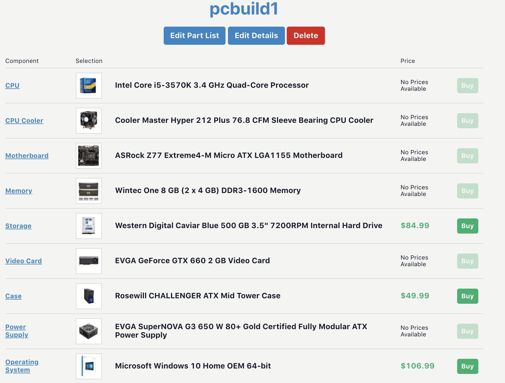

outline:

intro

building my first desktop pc

crappy laptops before I discovered used thinkpads

thinkpads and linux

dual booting my desktop

the work laptop

There seems to be a certain stigma that software developers have amazing home equipment. I mean why wouldn't we? A lot of us spend 12 hours in front of screens a day. And maybe this stigma is true, but for my entire career I have had destitute setups. Let's go through it.

It is the summer of 2012 and I am 17 years old. This is where I will begin the history of the computers that I still use daily. I had been working part time at a resturant to make enough money to buy some parts. I asked a friend if he had any experience assembling a computer and he directed me over to the subreddit [r/buildapc](https://www.reddit.com/r/buildapc/). It was here that I discovered the wonderful site [PC Part Picker](https://pcpartpicker.com/). And the build I came up with is still the rig I use 8 years later. I logged in to see if I could find my exact build, and lo and behold it is still there:

Good ol' **"pcbuild1"**.

What is not pictured here is my (still in use) graphics card: a Radeon HD 7870. A remarkable card that can still run modern games like Rocket League, League of Legends, and Fortnite.
